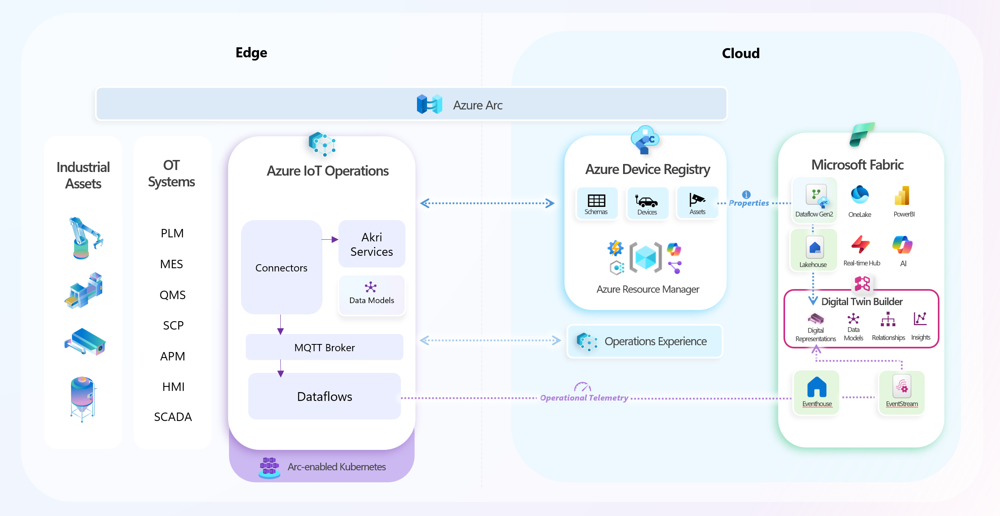

# One Digital Operations Experience - *Private Preview*

### Table of Contents

- [Overview](#overview)
  
- [Prerequisites](#prerequisites)

- [Step 0: Onboard deployment scripts](#step-0-onboard-deployment-scripts)
  
- [Step 1: Discover and Import OPC UA Assets](#step-1-discover-and-import-opc-ua-assets)
  
- [Step 2: Send Asset data to Microsoft Fabric](#step-2-send-asset-data-to-microsoft-fabric)
  
- [Step 3: Create Digital Representations of Assets](#step-3-create-digital-representations-in-digital-twin-builder)

# Overview 

This private preview introduces the **One Digital Operations (One DO) Experience**, designed to unify industrial IoT data across edge and cloud. It enables organizations to seamlessly integrate **Azure Device Registry (ADR)** assets, their operational data from **Azure IoT Operations (AIO)**, and standarized data models into **Microsoft Fabric** and **Digital Twin Builder (DTB)** (preview) for advanced analytics and accurate representations of their IoT environment.

With this integration, you can:

- **Discover OPC UA assets at the edge** with an OPC Publisher Akri connector in AIO and onboard them into ADR in the cloud.
  
- **Leverage Microsoft-curated asset models**, derived from OPC UA companion specifications, for consistent asset definitions.
  
- **Stream asset telemetry and metadata** from AIO and ADR into Microsoft Fabric, for rich digital representations of assets and insigts in DTB.

This experience eliminates manual steps and fragmented workflows, providing a single pane of glass for digital operations—from factory floor to predictive analytics.

## One DO Building Blocks
Each component plays a critical role in delivering a unified edge-to-cloud integration:

**Azure IoT Operations (AIO)**: A unified data plane for the edge, comprising modular, scalable, and highly available data services that operate on Azure Arc-enabled edge Kubernetes. With AIO, customers can discover and onboard their physical assets on factory floors and send structured data with set schemas using connectors (Akri) at the edge all the way to destinations like Microsoft Fabric. 

**Azure Device Registry (ADR)**: A unified registry for devices and assets across edge and cloud, acting as the single source of truth for asset metadata. In the cloud, assets are projected as Azure Resource Manager (ARM) resources, enabling management through Azure features scuh as resource groups, tags, RBAC, and policy, and integration with services like Resource Graph. At the edge, ADR creates Kubernetes custom resources for each asset and keeps cloud and edge representations synchronized. This ensures consistency across cloud and edge and simplifies lifecycle management through Azure-native tools.

**Digital Twin Builder(DTB)** *(preview)*: A new component within the Real-Time Intelligence workload in Microsoft Fabric that creates digital representations of real-world assets and processes using imported models and operational data. With DTB, customers can leverage low-code/no-code tools for modeling business concepts, building KPIs (such as OEE), and enabling advanced analytics for operational optimization. 




## **Why this matters:**

- **Single Pane of Glass**: All your operational data—models, assets, and telemetry—is accessible and actionable from Microsoft Fabric. 

- **Edge-to-Cloud Integration**: Data flows smoothly from devices at the edge, through the cloud, and into the applications of your choice. 

- **Operational Insights**: Seamlessly unlock scenarios like remote monitoring, predictive maintenance, and performance optimization.

- **Accelerated Onboarding**: Use Microsoft-curated models and streamlined setup to reduce time-to-value for new assets and use cases.

- **Scalability & Flexibility**: Supports model-based data transformation at scale and future integration with Azure IoT Hub.

## **How Data Comes Together**

#### 1. Model Management
Microsoft-curated Asset definition, derived from OPC UA companion specifications, define asset types and capabilities. These definitions are:

- Embedded in device endpoint configurations within Azure IoT Operations, enabling the discovery handler to automatically identify matching assets.

- Imported into Digital Twin Builder for entity creation, where they are modeled as entity types for downstream operations.

As a result, no manual model uploads are required and customers benefit from a curated, ready-to-use model library, ensuring consistency and accelerating onboarding.  

#### 2. Asset Metadata Ingestion

- Assets are discovered via OPC UA handlers and onboarded into Azure Device Registry with rich metadata.
  
- Using Dataflow Gen2 in Microsoft Fabric, these assets are ingested from ADR into a Lakehouse table. Filtering by asset type can also be applied within the Dataflow Gen2, ensuring only relevant assets are processed while preserving all metadata and lineage.

- Customers then create entities in Digital Twin Builder (DTB) based on the imported definitions and manually map these entities to records in the ADR Lakehouse table using asset UUIDs or external IDs.

This process gives customers full control and visibility over asset onboarding and mapping, ensuring data integrity and traceability across the entire stack.

#### 3. Real-Time Telemetry Streaming

- Once assets are configured and operational, AIO publishes telemetry to an MQ broker and routes it via AIO Dataflow to an Eventstream destination in Microsoft Fabric, using CloudEvents headers.
- DTB ingests telemetry directly from Eventstream, relying on strict alignment with the model’s structure and naming.
  
  > **Note:** Messages must conform to the model’s structure and naming; no transformation or schema mapping is allowed at this stage for private preview to retain the structure of message. DTB relies on typeref and field name alignment for ingestion.
  

This enables real-time, model-aware telemetry ingestion, delivering immediate operational insights with minimal setup and no manual schema management.

# Prerequisites

- An **Azure subscription**
  
- A deployed **Azure IoT Operations instance** (v1.2.x)
  
- An **Azure Device Registry namespace** to store your namespace assets and devices

- A **Microsoft Fabric tenant** that allows the creation of real-time dashboards and a **subscription** with access to a **workspace** with Contributor or above permissions.
  > For more information, see [Enable tenant settings in the admin portal](https://learn.microsoft.com/en-us/fabric/real-time-intelligence/dashboard-real-time-create#enable-tenant-settings-in-the-admin-portal)
  
- A **Digital Twin Builder item** in Microsoft Fabric
  > For more information, see [Digital Twin Builder (Preview) Tutorial: Set Up Resources](https://learn.microsoft.com/en-us/fabric/real-time-intelligence/digital-twin-builder/tutorial-1-set-up-resources)


# Step 0: Onboard Deployment Scripts
> [!NOTE]
> Some steps require using automation scripts, while others can be performed either manually or through scripts. 
>

Before proceeding, complete the following *[QuickStart Setup](./doc/QUICK_START_INIT.md)* to onboard the automation scripts into your environment.

# Step 1: Discover and Import OPC UA Assets

Identify, annotate, and onboard OPC UA assets by asset type at the edge using Akri and Azure IoT Operations. While some steps can be performed directly in the [Operations Experience](https://iotoperations.azure.com/) portal, others must be completed using the provided setup scripts.
 
### 1. Create an OPC Publisher Akri Connector
Use the following script to set up an OPC Publisher as an Akri connector.

This script creates and registers an Akri Connector Template that defines how OPC Publisher should run at the edge—including its image, configuration, and schema bindings.

```bash
./deploy_opc_publisher_template.sh
```

### 2. (Optional) Deploy Simulation Layer

Run the following script to deploy the **UMATI MachineTool Simulator**, which generates realistic OPC UA MachineTool telemetry using the [UMATI Sample Server](https://github.com/umati/Sample-Server).
This is a simple way to ingest data without needing real devices or assets connected.

```bash 
./deploy_umati.sh
 ```

### 3. Create Devices, Discover and Import Assets 
Create a device with an OPC UA device inbound endpoint and enable it for discovery to start importing assets using the *[Operations Experience](./doc/CREATE_DEVICES_AND_ASSETS.md)*.

> ⚡ **Fast-Track:** Run the following scripts to automate asset endpoint creation and asset onboarding:
> ```bash 
> ./register_umati_device.sh \
> ./onboard_fullmachine.sh
> ```
> See *[Onboarding UMATI Assets](./doc/CREATE_DEVICES_AND_ASSETS.md)* for more details.

# Step 2: Send Asset Data to Microsoft Fabric

### 1. Ingest Asset Telemetry from Azure IoT Operations
Ingest asset telemetry from Azure IoT Operations (AIO) into a Lakehouse table within Microsoft Fabric. Once ingested, the telemetry can then be mapped to entities in Digital Twin Builder, enabling rich digital representations of assets.
<details>
<summary>Click to expand/collapse the steps</summary>

#### 1. Create an Eventhouse in Microsoft Fabric
Create an Eventhouse where telemetry will land using the *[Microsoft Fabric UI](./doc/CREATE_EVENTHOUSE.md)*.

#### 2. Create an Eventstream in Microsoft Fabric
Set up an Eventstream destination to receive and process telemetry using the *[Microsoft Fabric UI](./doc/CREATE_EVENTSTREAM.md)*.

> ⚡ **Fast-Track:** Run the following script to automate Eventstream creation.
>
> This script:
> - Creates a Fabric Eventstream.
> - Saves source credentials to `./creds/dtb_hub_cred.json`.
>
>```bash
># Optional: use a specific Fabric workspace instead of "My workspace"
># export FABRIC_WORKSPACE_ID="<workspace-guid>"
>
># Optional: change the display name (default: DTB-GP-Test)
># export DISPLAY_NAME="DTB-GP-Custom"
>
>./deploy_eventstream.sh
>```
>
> *⚠️ Treat that file as a secret and delete it once your deployment is configured.*
>

#### 2. Create an Azure IoT Operations Dataflow 
Configure a Dataflow to route telemetry from AIO to your Eventstream via the *[Operations Experience](./doc/CREATE_DATAFLOW.md)*.

> ⚡ **Fast-Track:** Run the following script to automate Dataflow creation:
>```bash
>./deploy_dataflow.sh
>```
>
> *⚠️ This fast-track script can only be used if the Eventstream was created using the fast-track script from the previous step.*

#### 3. Setup Eventstream for Telemetry Ingestion in Microsoft Fabric 
See *[Ingest Asset Telemetry to Microsoft Fabric](./doc/EVENTSTREAM_TELEMETRY_FABRIC.md)* for full instructions.

</details>

### 2. Ingest Asset Metadata from Azure Device Registry
Ingest asset metadata stored in Azure Device Registry (ADR) into a Lakehouse table within Microsoft Fabric. This metadata provides essential context, such as version, manufacturer, location, and custom attributes, that can be mapped to entities in Digital Twin Builder. When combined with telemetry data, it enables more accurate modeling, monitoring, and analysis of your assets and operations.

See *[Ingest Asset Metadata from ADR to Microsoft Fabric](doc/INGEST_ADR_METADATA.md)* for full instructions.


# Step 3: Create Digital Representations in Digital Twin Builder
Use the imported metadata and telemetry of assets to build rich digital representations in Digital Twin Builder (preview).

### 1. Add Entity Types
Add entity types to your Digital Twin Builder ontology to later hydrate instances with data: *[Create Entities in DTB](./doc/DTB_ENTITY_CREATION.md)*

### 2. Map Azure Device Registry Assets to Entity Types
Link asset metadata (non-timeseries data) from a Lakehouse table to an entity type: *[Map Asset Metadata to Entity Types](./doc/DTB_MAPPING_METADATA.md)*

### 3. Map Asset Telemetry to Entity Types
Link asset telemetry (timeseries data) from Eventstream to an entity type: *[Map Asset Telemetry to Entity Types](./doc/DTB_MAPPING_TELEMETRY.md)*
