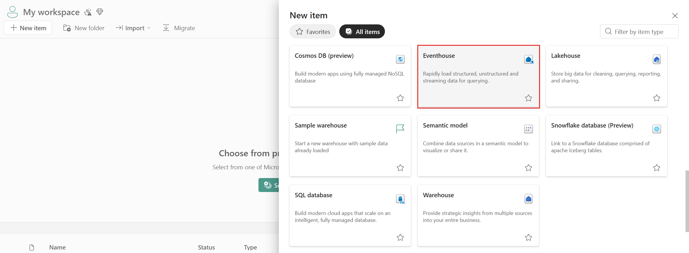

# Create an Eventhouse in Microsoft Fabric

An **Eventhouse** in Microsoft Fabric is a high-throughput, analytics-optimized destination for real-time event data. It’s designed to store and query large volumes of telemetry efficiently. 

This Eventhouse will later be used as the **destination** for an **Eventstream**, which serves as the pipeline for ingesting telemetry from sources like AIO. By setting up the Eventhouse first, you ensure it’s ready to receive data when you configure the Eventstream in the next step.

1. In the Fabric portal, go to **New item → Eventhouse**.
   
2. Enter a **Name** for the Eventhouse (for example: `TelemetryEventhouse`).
3. Choose a **Workspace** and **Capacity** where the Eventhouse will reside.
4. Click **Create**.

⚠️ **Heads-up:** This pane contains sensitive information (namespace, hub, connection string, etc.). Keep this window open for reference during the Dataflow setup, but handle the credentials securely — treat them like passwords.
