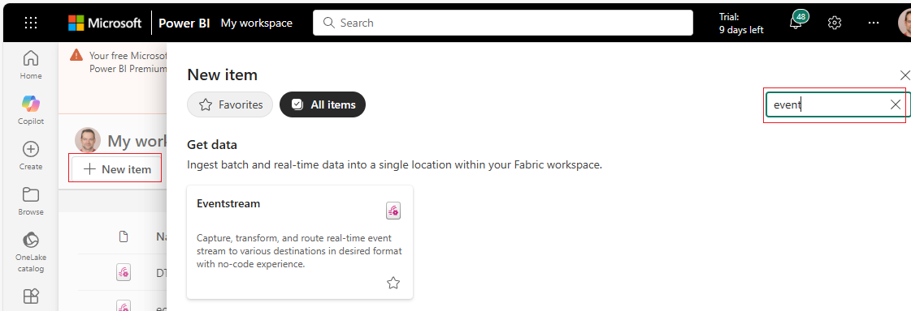
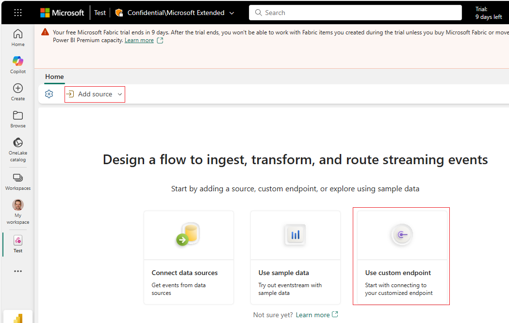
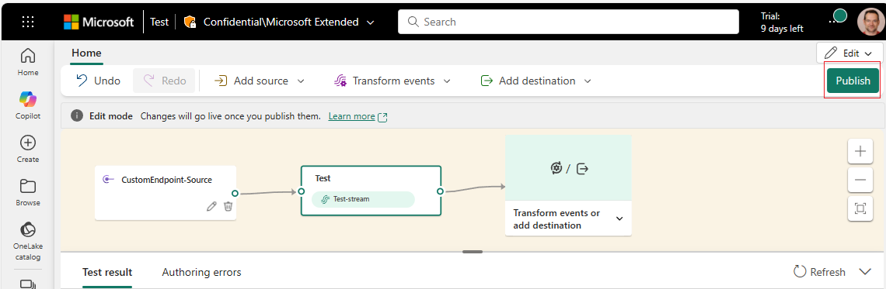
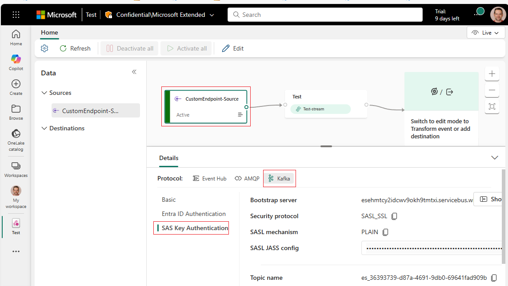

### Create Eventstream

Before setting up a **Dataflow** to push telemetry from AIO into Fabric, we first need to create an **Eventstream** with a **Custom Endpoint source**. This endpoint provides the credentials and connection details that AIO will later use to send data.

1. In the Fabric portal, go to **New item → Eventstream**.
   
2. Enter a **Name** for the Eventstream (for example: `DTB-GP-Test`).
3. Click **Create**.

Once the Eventstream is created:

1. With **Add source** selected at the top, choose **Use custom endpoint**.
   
2. Provide a name for the custom source (or keep the default) and click **Add**.
3. On the next screen, click **Publish**.

   *At this stage the Eventstream has no target. That’s fine — for now the goal is simply to obtain the **source credentials** needed later when configuring the Dataflow.*
   
4. After publishing, click on the endpoint source you just created, switch to the **Kafka** tab, and select **SAS Key Authentication**.
   

⚠️ **Heads-up:** This pane contains sensitive information (namespace, hub, connection string, etc.). Keep this window open for reference during the Dataflow setup, but handle the credentials securely — treat them like passwords.
