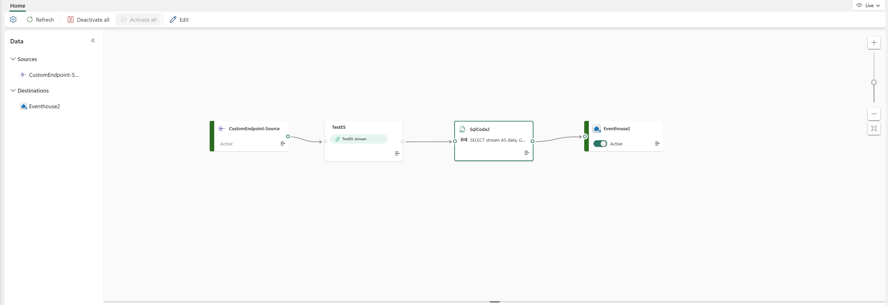
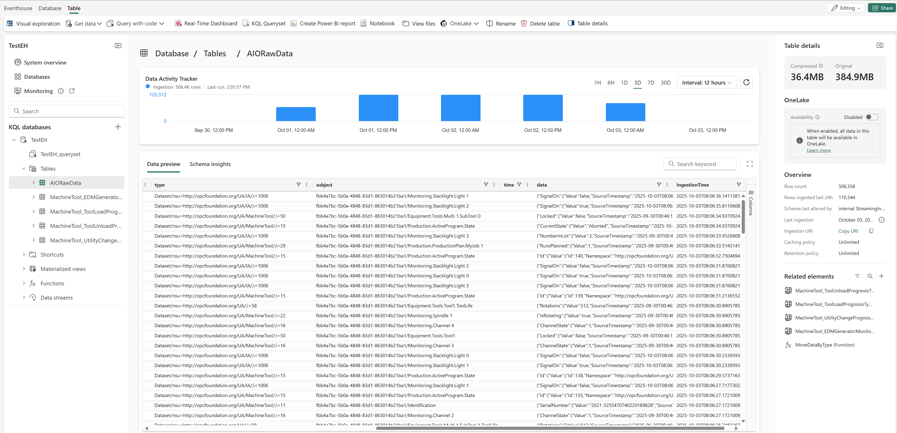

# Setup Eventstream for Telemetry Ingestion in Microsoft Fabric 

## 1. Prepare Eventhouse to receive telemetry from Eventstream 
Navigate to the previously created Eventhouse which will receive telemetry from Eventstream. Save your Fabric Eventhouse **Ingestion URI**.

## 2. Update Eventstream with a SQL Code Transform and Eventhouse as Target 

1. Navigate to your Eventstream and add a Transform step of type **SQL Code** in Eventstream.

2. Add a Destination of type **Eventhouse** in Eventstream, and connect it to the SQL Code step. Use the Eventhouse **Ingestion URI** from the previous step.

    Use the following SQL Code: 
  
    ```sql
    SELECT 

    stream AS data, 

    GETMETADATAPROPERTYVALUE(stream,'[User].[ce_subject]') AS subject, 

    GETMETADATAPROPERTYVALUE(stream,'[User].[ce_type]') AS type 

    INTO [EventhouseName] FROM [EventStreamName-stream] AS stream
    ```
    

## 3. See Data Flowing to your Eventhouse
Navigate to your Eventhouse to see data flowing from Azure IoT Operations


