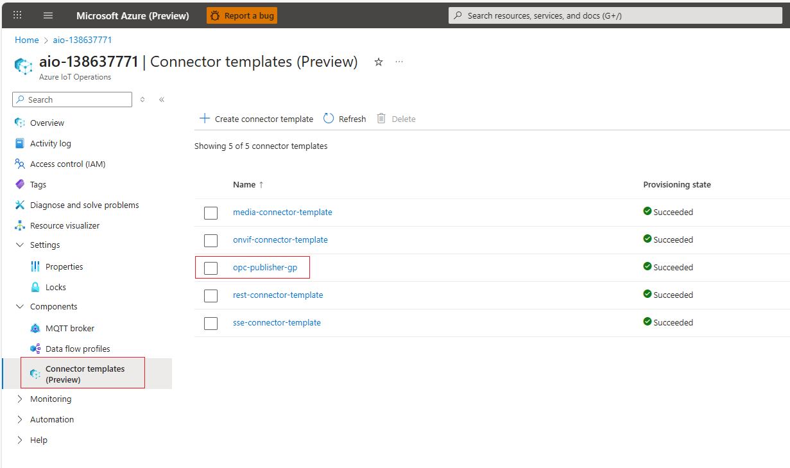
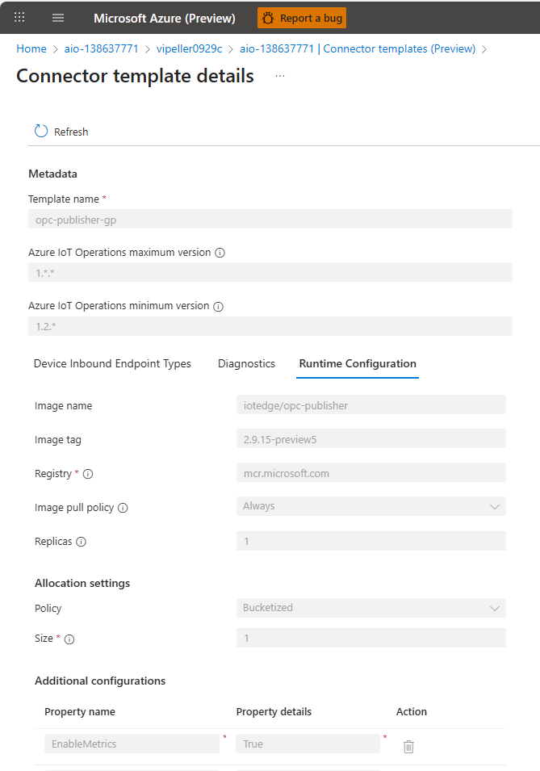

### Deploy Connector Template

Currently, **creating a connector template cannot be done through the UI**. However, you can still verify the result once deployed.

As a first step, execute the following script:

```bash
./deploy_opc_publisher_template.sh
```

After the script completes, navigate to your **Azure IoT Operations instance** in the Azure Portal.
The newly installed template should appear in the **Connector Templates** list:



Selecting the installed **opc-publisher** template shows its configured parameters:


