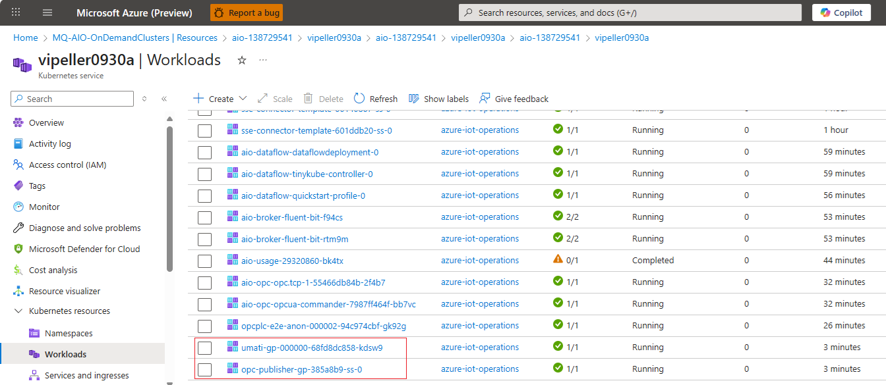
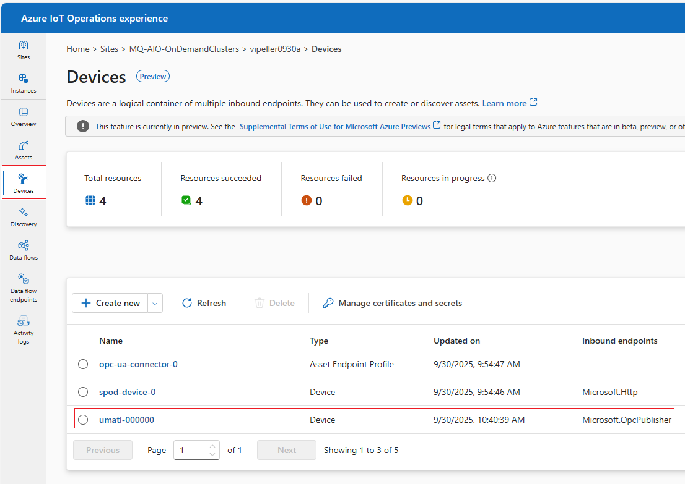

### Install the UMATI Simulator

The UMATI Machine Tool Simulator cannot currently be deployed directly through the UI — installation must be done via script. This script deploys the simulator into your Kubernetes cluster and also registers a matching **ADR device** so that assets can be discovered and onboarded downstream.

Execute the following script:

```bash
./deploy_umati.sh
```

Once the script has run successfully:

1. Navigate to your **Azure IoT Operations Kubernetes Service** in the Azure portal.
2. Under **Workloads** → **Pods**, you should see the UMATI simulator pod running in the target namespace (usually `azure-iot-operations`).



3. In **Azure IoT Operations experience**, you should now see a new device entry created for the simulator.



This simulator publishes realistic OPC UA MachineTool variables and events.
