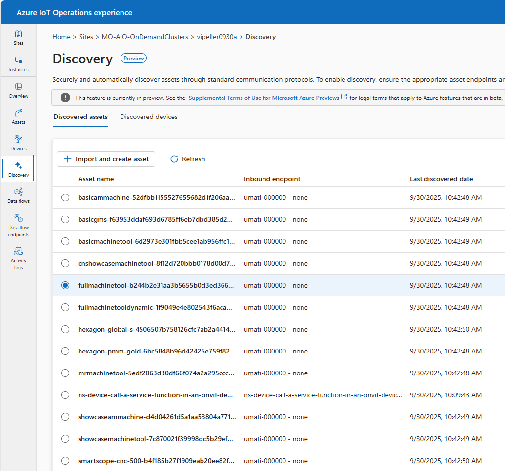
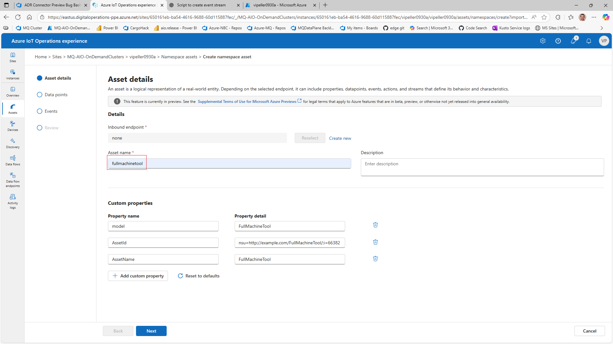
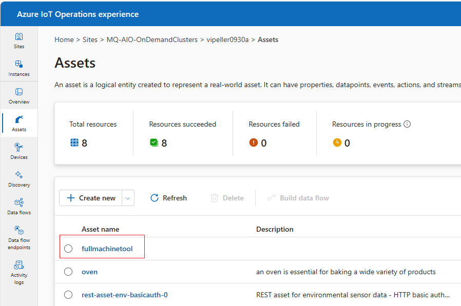

With the **OPC Publisher Connector** and **UMATI Simulator** deployed, the system begins discovering OPC UA endpoints. After a short delay, discovered assets will appear in the **Azure IoT Operations Experience** portal.

1. Locate the discovered asset whose name starts with `fullmachinetool`.
2. Select it and click **Import and create asset**.
3. On the **Asset details** page, assign a name to the new asset.

⚠️ **Heads-up:** Remember this name carefully — it will be part of the subscription string later when setting up your **Dataflow**.

4. Click `next` on the `Data points` and `Events` pages, and press `Create` on the `Review` Page.

With some delay, the new asset will be listed on the Asset page:

